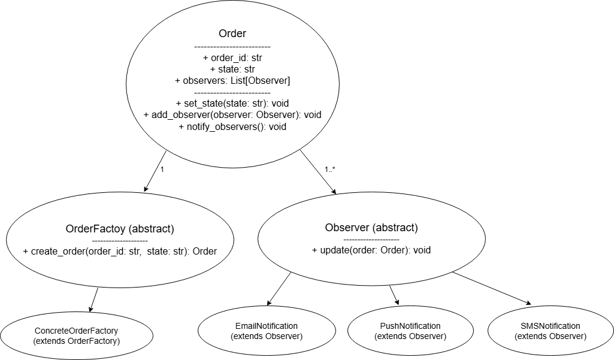

## OrderFlow

Sistema de gerenciamento de ordens baseado em TypeScript que utiliza padrões de design como Factory Method e Observer para simplificar a criação, rastreamento e notificação de ordens. 

Construído com foco em arquitetura limpa e princípios de design escaláveis.

## Tecnologias

- TypeScript
- Node.js
- Express
- SQLite

## Instalação

```bash
npm install
```

## Execução

```bash
npm run build
npm run start
```

## Diagrama



## Apresentação

[Clique aqui para acessar a apresentação](https://www.canva.com/design/DAGXmXp9Puw/U0OqboMtPji7tFGMOEfCBQ/edit?utm_content=DAGXmXp9Puw&utm_campaign=designshare&utm_medium=link2&utm_source=sharebutton)

## Autores

- Danilo Formanski
- João Vitor Brogni Vamerlati
- Vinicius Albino dos Santos
- Vitor Minatto Barp
- Yuri Lopes Machado
